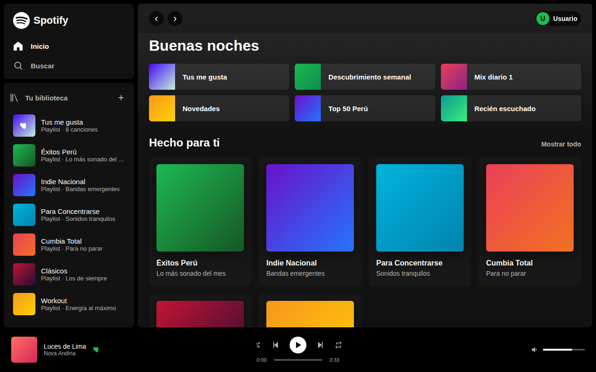

# 🎵 Spotify Clone — React

Clon de la interfaz de **Spotify** construido con **React + Vite** como proyecto final.
Recrea la experiencia de la app de escritorio: barra lateral con biblioteca, pantalla
de inicio con atajos y playlists, lista de canciones y un **reproductor funcional** con
play/pausa, navegación entre canciones y barra de progreso que avanza en tiempo real.



## ✨ Características

- 🎨 **Interfaz fiel a Spotify**: tema oscuro, acento verde `#1DB954` y layout responsivo.
- 🧩 **Arquitectura por componentes**: `Sidebar`, `MainContent`, `PlaylistCard`, `TrackList` y `Player`.
- ⚡ **Estado con Hooks de React**: `useState` para la canción actual y el play/pausa; `useEffect` para la barra de progreso.
- ▶️ **Reproductor interactivo**: play/pausa, anterior/siguiente, avance automático al terminar la canción y "seek" haciendo clic en la barra.
- 📱 **Responsive**: se adapta a pantallas pequeñas.
- 🖼️ **Sin dependencias pesadas**: las portadas son gradientes CSS y los íconos son SVG en línea, así no hay imágenes rotas ni librerías extra.

## 🛠️ Tecnologías

- [React 18](https://react.dev/)
- [Vite 5](https://vitejs.dev/)
- CSS plano (un archivo de estilos por componente)

## 📂 Estructura del proyecto

```
spotify-clone/
├── index.html
├── package.json
├── vite.config.js
└── src/
    ├── main.jsx              # Punto de entrada de React
    ├── App.jsx               # Estado global y layout principal
    ├── index.css             # Reset y variables de color
    ├── data/
    │   └── tracks.js         # Canciones, playlists y utilidades
    └── components/
        ├── Sidebar.jsx       # Barra lateral + biblioteca
        ├── MainContent.jsx   # Inicio: saludo, atajos, tarjetas y lista
        ├── PlaylistCard.jsx  # Tarjeta reutilizable de playlist
        ├── TrackList.jsx     # Lista de canciones (clic = reproducir)
        ├── Player.jsx        # Reproductor inferior con progreso
        └── Icons.jsx         # Íconos SVG en línea
```

## 🚀 Cómo ejecutarlo en local

Requisitos: [Node.js](https://nodejs.org/) 18 o superior.

```bash
# 1. Instalar dependencias
npm install

# 2. Levantar el servidor de desarrollo
npm run dev

# 3. Abrir el navegador en la URL que aparece (por defecto http://localhost:5173)
```

Para generar la versión de producción:

```bash
npm run build     # genera la carpeta dist/
npm run preview   # previsualiza el build
```

## 🌐 Deploy

El proyecto está desplegado en: **[LINK]**

## 📹 Presentación

Video explicativo (teoría + demo): **[LINK DE YOUTUBE]**

## 👤 Autor

Enrique Chavez — Proyecto final.

---